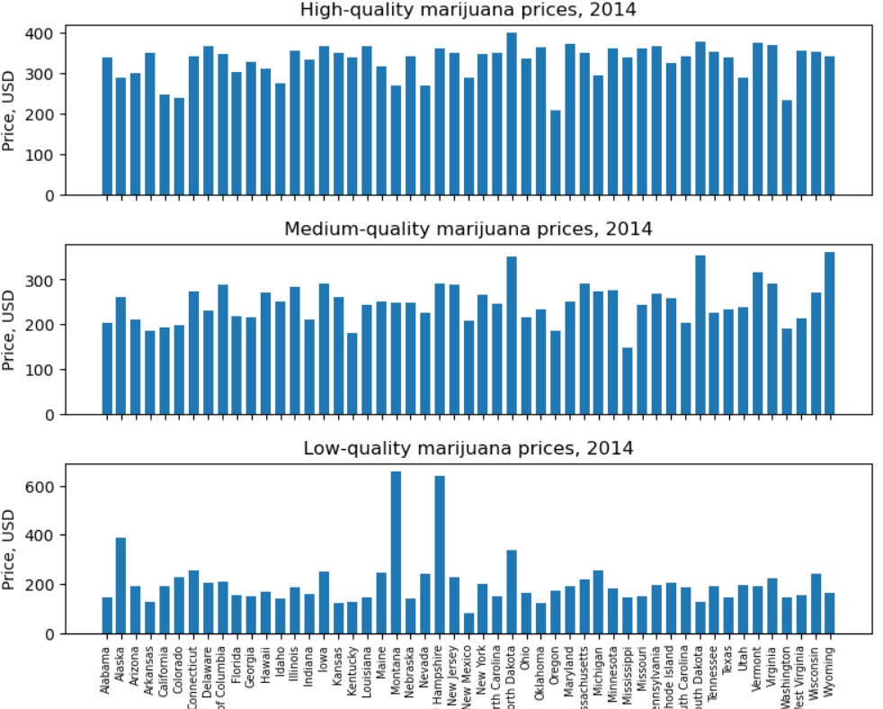
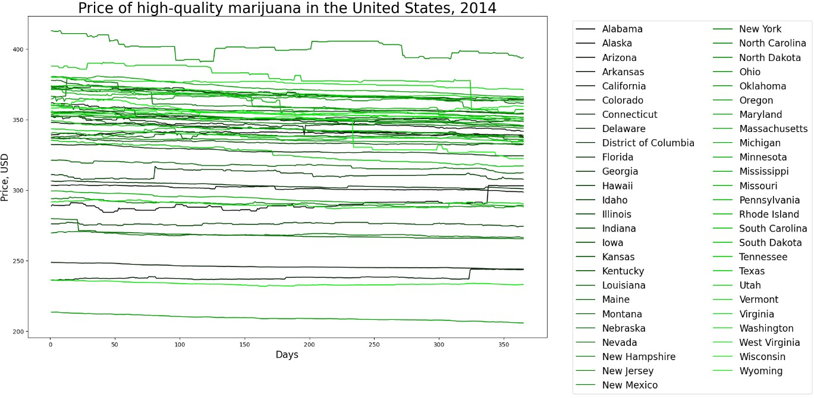
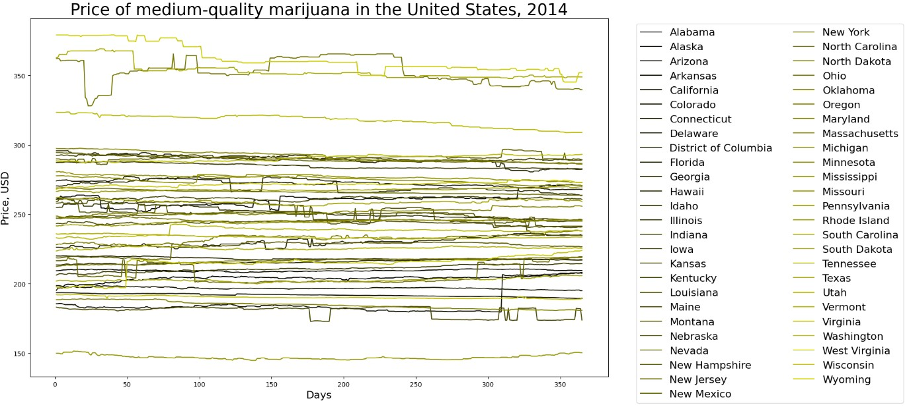
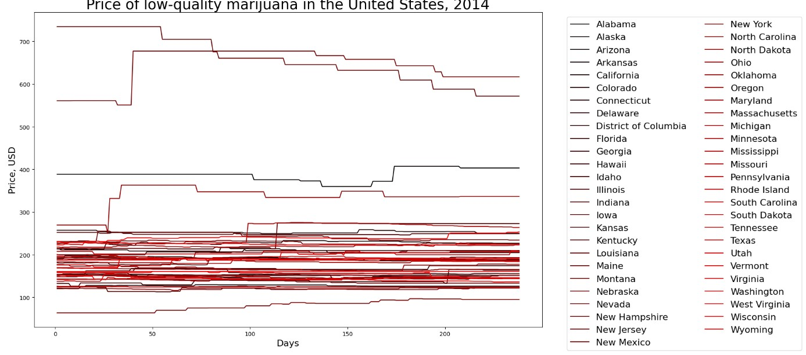
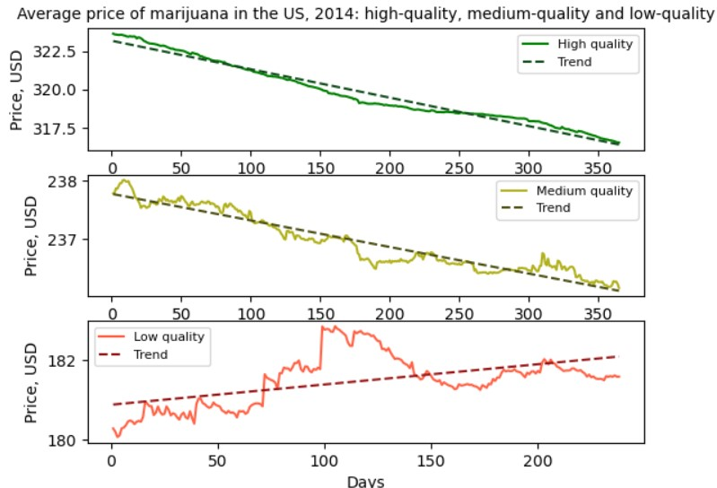
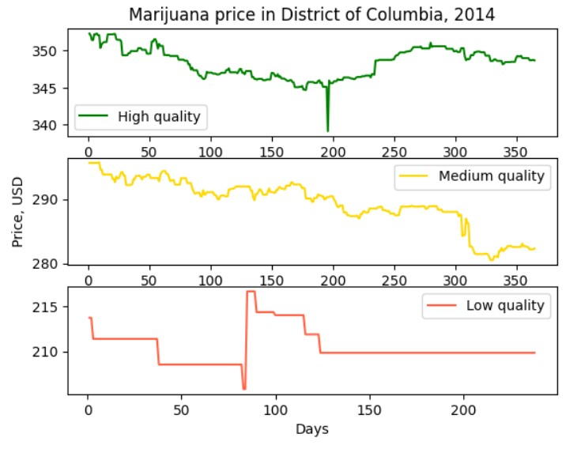
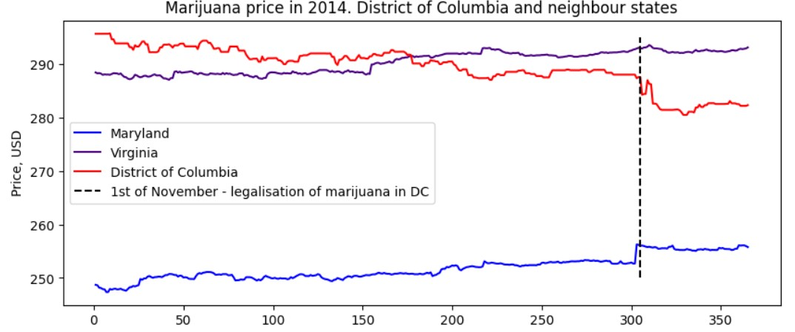
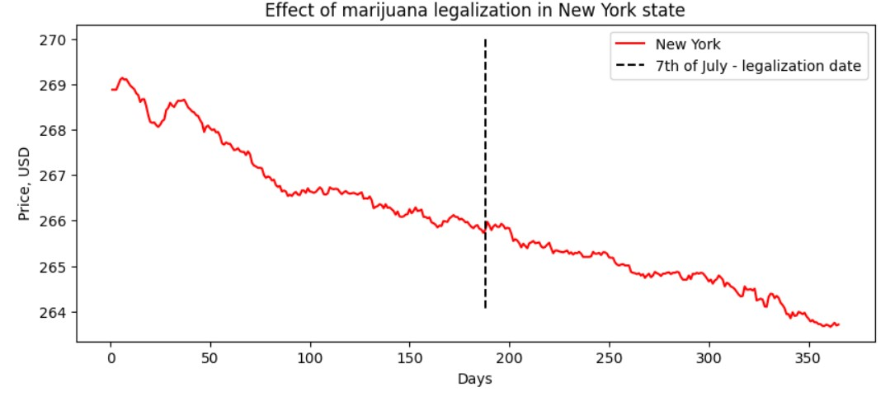
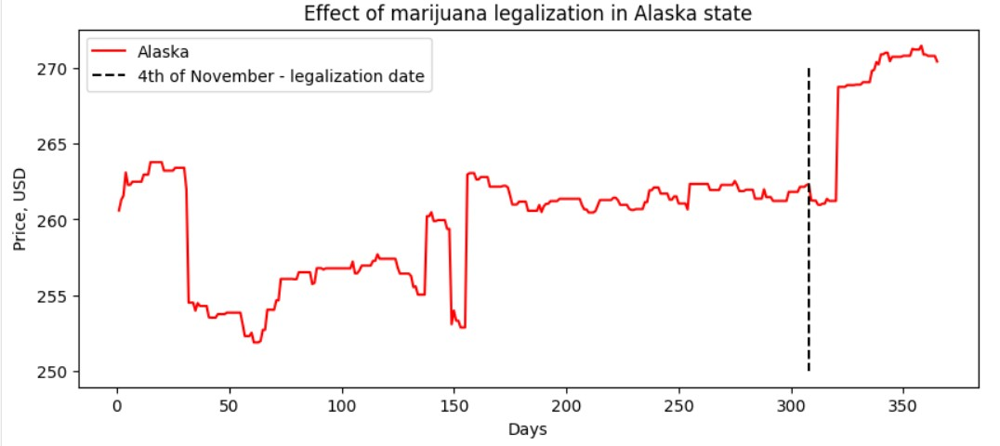

**Анализ цен на марихуану в США в 2014 году**

Проект направлен на анализ динамики цен на марихуану разного качества (высокое, среднее и низкое) в различных штатах США в 2014 году. С помощью данных о ценах и объемах продаж в каждом штате, этот проект исследует, как цены варьировались в течение года и как различные события, такие как легализация в некоторых штатах, повлияли на эти цены.

Целью является не только показать средние цены по штатам и видам марихуаны, но и выявить закономерности и тренды, а также дать возможность увидеть, как ценовые изменения коррелируют с политическими событиями и особенностями отдельных штатов.

**Реализация данного проекта необходима для:**

1\. Понимания рыночных трендов: Анализируя изменения цен на марихуану, можно выявить экономические тенденции и зависимости в индустрии, что важно для оценки рынка как с экономической, так и с социологической точки зрения.

2\. Исследования влияния легализации: Важным аспектом является влияние легализации на цены, особенно в таких местах, как округ Колумбия и другие штаты, где прошли законодательные изменения.

3\. Поддержки будущих исследований: Созданные графики и модели могут быть полезны для дальнейшего исследования рынков марихуаны и могут служить основой для анализа в других временных периодах и регионах.

Проект состоит из нескольких скриптов, выполняющих отдельные задачи. Вот описание каждой задачи и итоговый результат:

\- Задача: Подсчитать среднюю цену марихуаны каждого качества за весь год по каждому штату.

\- Результат: Создаются три массива, представляющих средние цены на марихуану высокого, среднего и низкого качества для 52 штатов. Эти данные визуализируются на графиках, что позволяет наглядно увидеть разброс цен между штатами. Мы видим, что максимальные цены на товар высокого качества в Северной Дакоте (400,84$), на товар среднего качества в Вайоминге(361,9$) и на товар низкого качества в штате Монтана (658,27$). Минимальные цены на траву высокого качества в Орегоне (209.37$), на среднее качество в Миссисипи (147.11$) и на низкое качество в Нью-Мехико (209.37$). видны всплески на марихуану низкого качества, но они не поддаются аналитике.

\- Задача: Построить линейные графики изменения цен на марихуану каждого качества для каждого штата с уникальной цветовой схемой.

\- Результат: Графики показывают изменение цены марихуаны высокого, среднего и низкого качества по дням года для каждого штата. Они позволяют оценить сезонные и географические различия в ценах. 

\- Задача: Рассчитать средние цены по дням для всех штатов вместе с линейными трендами.

\- Результат: Создаются массивы, представляющие средние цены на марихуану разного качества, с учетом всех штатов и весовых коэффициентов. Это позволяет создать сглаженные тренды для каждой категории, которые затем отображаются на графиках. Цена на дорогую падает быстрее цены на среднюю, а цена на дешевую растет. Может быть связано с изменением спроса на товар и декриминализацией

\- Задача: Построить графики изменений цен на марихуану в округе Колумбия (Вашингтон, DC) для всех трех уровней качества.

\- Результат: Полученные графики позволяют видеть динамику цен на марихуану в округе Колумбия, где произошли законодательные изменения. Этот график позволяет сравнить ценовые колебания до и после легализации.

\- Задача: Сравнить цены на марихуану в округе Колумбия с соседними штатами (Мэриленд и Вирджиния) и отметить дату легализации.

\- Результат: Построенные графики показывают различия в ценах и выделяют влияние легализации на стоимость марихуаны в округе Колумбия по сравнению с соседними штатами. Наблюдается падение цены в округе Колумбия и предварительный подъем в штате Мэриленд. Может быть взаимосвязано, но нужно искать дополнительные данные

\- Задача: Провести отдельный анализ для штатов Аляска и Нью-Йорк с выделением значимых событий.

\- Результат: Графики для Аляски и Нью-Йорка с вертикальными линиями позволяют анализировать цены на фоне событий, таких как возможные изменения в политике штатов. Скачки в Аляске есть всегда, поэтому корреляцию заметить сложно. В Нью-Йорке ситуация аналогична. Нужно следить за изменением параметра доступности по времени и искать взаимосвязи. Но это темма для отдельного исследования)

Проект позволяет получить всестороннее представление о динамике цен на марихуану в США в 2014 году. Каждый скрипт выполняет определенную задачу, от подготовки данных до визуализации влияния событий, таких как легализация. Полученные графики дают возможность исследовать и интерпретировать рынок в зависимости от политических и сезонных факторов.  

 **Список авторов**

Студенты БГЕО231 Мокрушин Андрей и Борубаева Алия